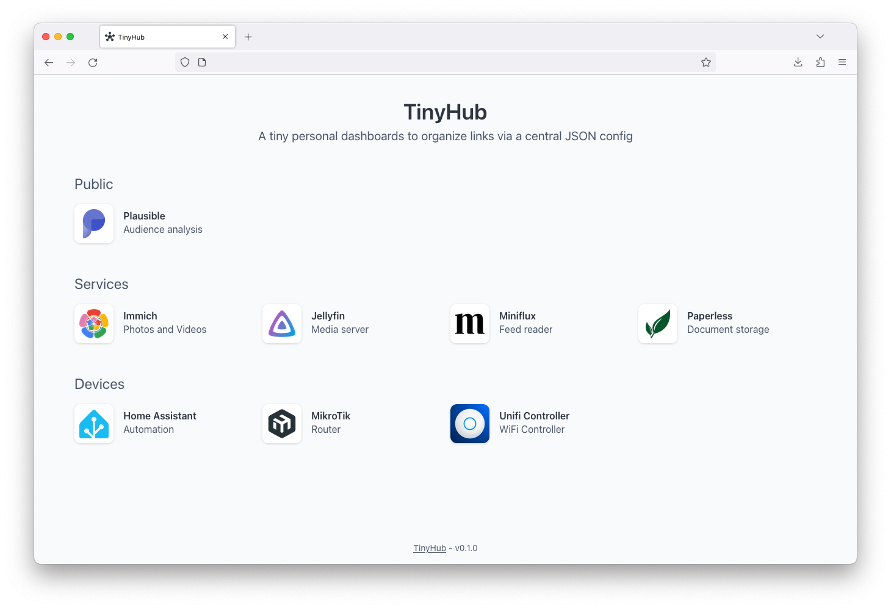

# TinyHub

A tiny personal dashboards to organize links via a central JSON config.



## Docker

`docker-compose.yml`:
```
services:
  tinyhub:
    image: vermotr/tinyhub:v0.1.0
    ports:
      - 8080:80
    volumes:
      - ./config.json:/app/config.json
      - ./icons:/app/icons
```

## Config

`config.json`:
```json
{
  "title": "TinyHub",
  "description": "A tiny personal dashboards to organize links via a central JSON config",
  "sections": [
    {
      "name": "Section",
      "services": [
        {
          "name": "Service",
          "uri": "https://github.com/vermotr/tinyhub",
          "description": "Service description",
          "icon": "/icons/service.png", // optional
          "iconAspect": "full" // optional
        }
      ]
    }
    …
  ]
}
```

## License

The MIT License (MIT) - see LICENSE for more details
